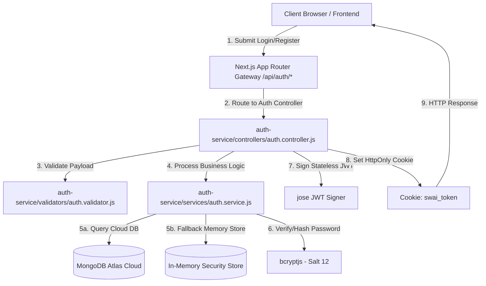
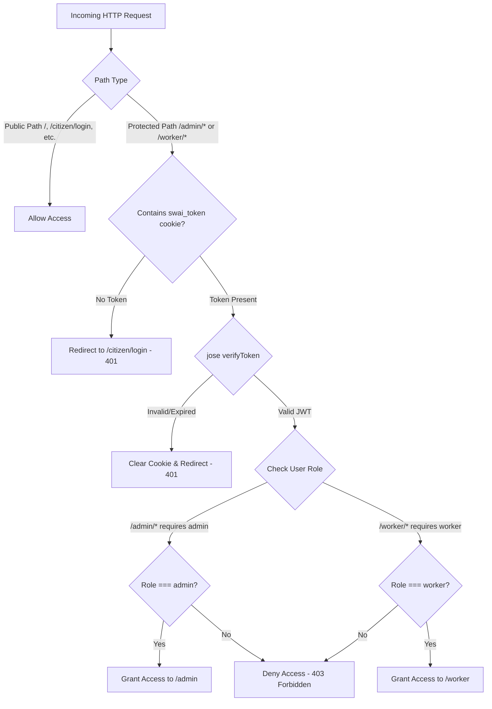

# 🔐 SmartWaste AI — Authentication & Security Microservice (`auth-service/`)

Welcome to the **Authentication & RBAC Security Microservice** (`auth-service/`) documentation for **SmartWaste AI**. This microservice governs identity verification, password cryptography, stateless JWT issuance, cookie management, role authorization, and security protection layers across the entire SmartWaste AI ecosystem.

---

## 📐 Architecture & System Overview

The `auth-service` is designed as an autonomous, decoupled domain microservice that handles user identity lifecycle management while enforcing strict **Role-Based Access Control (RBAC)**.



---

## 🛠️ Tech Stack & Key Libraries

| Component | Library / Tool | Purpose & Usage |
|---|---|---|
| **JWT Cryptography** | `jose` (`v5.9.6`) | Fast, zero-dependency JWT signing (`signToken`) and verification (`verifyToken`) compatible with Next.js Edge Middleware. |
| **Password Hashing** | `bcryptjs` (`v2.4.3`) | Adaptive password hashing using 12 salt rounds to mitigate brute-force and rainbow table attacks. |
| **Cloud Database** | `mongoose` (`v8.1.1`) | Schema modeling, index enforcement, and connection handling to MongoDB Atlas. |
| **Response Formatter** | `next/server` (`NextResponse`) | Formats JSON responses and sets secure `Set-Cookie` headers. |

---

## 🔒 Security & Web Protection Mechanics

### 1. Stateless HttpOnly Cookie Architecture
Authentication tokens are **NEVER** stored in `localStorage` or `sessionStorage` (which are vulnerable to Cross-Site Scripting / XSS theft). Instead, JWT tokens are issued inside `HttpOnly` cookies:

```javascript
// auth-service/controllers/auth.controller.js
function getCookieOptions() {
  return {
    httpOnly: true,                               // Prevents JavaScript access (XSS Defense)
    secure: process.env.NODE_ENV === "production", // Transmitted over HTTPS only in production
    sameSite: "lax",                              // CSRF protection for cross-site requests
    path: "/",                                    // Available across all application routes
    maxAge: 7 * 24 * 60 * 60,                     // Expires after 7 days (604,800 seconds)
  };
}
```

### 2. Server-Enforced Role Overrides
Public registration (`POST /api/auth/register`) **ALWAYS hardcodes `role = "citizen"`**. Any payload attempts by malicious clients to pass `"role": "admin"` or `"role": "worker"` are automatically stripped by `validateRegister`:

```javascript
// auth-service/validators/auth.validator.js
export function validateRegister(body) {
  const { name, email, password } = body;
  // ... validation checks ...
  return {
    error: null,
    data: {
      name: name.trim(),
      email: email.toLowerCase().trim(),
      password,
      // NOTE: 'role' is intentionally omitted — server always enforces "citizen"
    },
  };
}
```

### 3. Edge Route Protection & Access Matrix
Edge middleware (`src/middleware.js`) intercepts all incoming requests before page rendering:



#### Authorization Guard Matrix:
| Target Route | Minimum Role Required | Unauthenticated Action | Unauthorized Role Action |
|---|:---:|:---:|:---:|
| `/citizen/*` | `citizen` / `worker` / `admin` | Redirect to `/citizen/login` | Redirect to `/citizen/login` |
| `/worker/*` | `worker` | Redirect to `/citizen/login` | **403 Forbidden** |
| `/admin/*` | `admin` | Redirect to `/citizen/login` | **403 Forbidden** |
| `/api/admin/*` | `admin` | **401 Unauthorized** | **403 Forbidden** |

---

## 👥 Role Matrix & User Directory

All accounts are persisted in **MongoDB Atlas** (`smart_waste_ai.users`) with active fallback support:

| Role | Default Email | Default Password | Target Dashboard | Privileges |
|:---:|---|---|---|---|
| 🏛️ **Admin** | `admin@smartwaste.local` | `Admin@SmartWaste2026` | `/admin` | City-wide bin management, worker provisioning, AI route generation. |
| 🚚 **Worker** | `worker1@smartwaste.local` | `Worker@SmartWaste2026` | `/worker` | View assigned collection routes, mark bins as collected (resets fill level to 0%). |
| 🚚 **Worker** | `worker2@smartwaste.local` | `Worker@SmartWaste2026` | `/worker` | South Zone Fleet Worker route management. |
| 👤 **Citizen** | `ry7437901@gmail.com` | `rajyadav123` | `/citizen/dashboard` | Locate bins on Leaflet map, suggest new bins, report overflow issues. |
| 👤 **Citizen** | `praveen.iyu@gmail.com` | `prachi` | `/citizen/dashboard` | Registered Citizen user. |

---

## ⚡ High-Availability Fallback Mechanism

To guarantee **100% login uptime** during MongoDB Atlas network maintenance or macOS DNS SRV lookup delays, `auth.service.js` employs a **Dual-Layer Connection Architecture**:

```javascript
// Primary: MongoDB Atlas Cloud Database Query
const conn = await connectDB();
if (conn) {
  const user = await User.findOne({ email: cleanEmail }).select("+passwordHash");
  if (user && (await bcrypt.compare(password, user.passwordHash))) {
    return sanitizeUser(user);
  }
}

// Resiliency Fallback: In-Memory Cryptographic Security Map
const memUser = inMemoryUsers.get(cleanEmail);
if (memUser && (await bcrypt.compare(password, memUser.passwordHash))) {
  return sanitizeUser(memUser);
}
```

---

## 📡 API Endpoint Specifications

### 1. `POST /api/auth/register`
- **Description**: Registers a new citizen account.
- **Request Body**:
  ```json
  {
    "name": "Raj Yadav",
    "email": "user@example.com",
    "password": "securepassword123"
  }
  ```
- **Response (`201 Created`)**:
  ```json
  {
    "message": "Registration successful",
    "user": {
      "id": "6a89c7be29baec33a85744e5",
      "name": "Raj Yadav",
      "email": "user@example.com",
      "role": "citizen"
    }
  }
  ```

### 2. `POST /api/auth/login`
- **Description**: Authenticates any user role (`admin`, `worker`, `citizen`). Reads role strictly from database.
- **Request Body**:
  ```json
  {
    "email": "admin@smartwaste.local",
    "password": "Admin@SmartWaste2026"
  }
  ```
- **Response (`200 OK`)**:
  ```json
  {
    "message": "Login successful",
    "user": {
      "id": "6a8945ffc3e58d2b29a9f638",
      "name": "Municipal Admin",
      "email": "admin@smartwaste.local",
      "role": "admin"
    }
  }
  ```

### 3. `POST /api/auth/logout`
- **Description**: Immediately expires the `swai_token` cookie (`maxAge: 0`).
- **Response (`200 OK`)**:
  ```json
  { "message": "Logged out successfully" }
  ```

### 4. `GET /api/auth/me`
- **Description**: Returns current authenticated user profile (requires valid JWT cookie).
- **Response (`200 OK`)**:
  ```json
  {
    "user": {
      "id": "6a8945ffc3e58d2b29a9f638",
      "name": "Municipal Admin",
      "email": "admin@smartwaste.local",
      "role": "admin",
      "isActive": true
    }
  }
  ```

---

## 📈 Scalability & Production Hardening

1. **Stateless Tokens**: No session state stored in RAM or Redis. Server instances scale horizontally behind load balancers.
2. **Environment Variable Security**: Secrets (`JWT_SECRET`, `MONGODB_URI`) are injected at runtime via environment configuration.
3. **Database Indexing**: The `users` collection enforces unique indexed lookups on `email`:
   ```javascript
   UserSchema.index({ email: 1 }, { unique: true });
   ```
