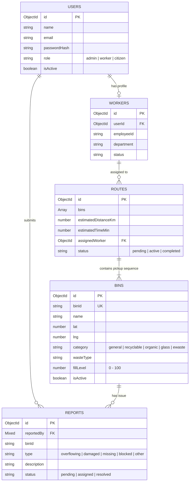

# 🧠 SmartWaste AI — Brain Core Microservice (`brain-service/`)

Welcome to the **Brain Core Microservice** (`brain-service/`) documentation for **SmartWaste AI**. This microservice encapsulates the core domain logic of the municipal waste management system, including smart bin telemetry, geospatial proximity queries, citizen issue reporting, municipal worker operations, AI-optimized collection route planning, and city analytics.

---

## 🏛️ Domain Architecture Overview

`brain-service` is organized into **6 modular sub-domains**:

```
brain-service/
├── 🏛️ admin/           # Municipal Command Center operations & worker account management
├── 👷 workers/         # Municipal worker route assignment & job tracking
├── 🗑️ bins/            # Smart bin telemetry, geospatial queries & fill-level updates
├── 📢 reports/         # Citizen & worker bin problem issue reporting
├── 🚚 routes/          # AI Greedy Nearest-Neighbor collection route optimization
└── 📊 analytics/       # City-wide metrics calculation & aggregation pipelines
```

---

## 📐 End-to-End System Architecture Diagram

```mermaid
graph TD
    subgraph Frontend Portals
        CitizenPortal[Citizen Dashboard & Find Bin Map]
        AdminPortal[Admin Command Center /admin]
        WorkerPortal[Worker Route Portal /worker]
    end

    subgraph API Gateway (src/app/api/)
        BinsAPI[/api/bins]
        ReportsAPI[/api/reports]
        AdminAPI[/api/admin/*]
        WorkerAPI[/api/worker/*]
    end

    subgraph Brain Core Microservice (brain-service/)
        BinDomain[bins/services/bin.service.js]
        ReportDomain[reports/services/report.service.js]
        RouteDomain[routes/services/route.service.js]
        WorkerDomain[workers/services/worker.service.js]
        AdminDomain[admin/services/admin.service.js]
        AnalyticsDomain[analytics/services/analytics.service.js]
    end

    subgraph Storage Layer (MongoDB Atlas)
        BinsCol[(bins Collection)]
        ReportsCol[(reports Collection)]
        RoutesCol[(routes Collection)]
        UsersCol[(users Collection)]
        WorkersCol[(workers Collection)]
    end

    CitizenPortal --> BinsAPI & ReportsAPI
    AdminPortal --> AdminAPI
    WorkerPortal --> WorkerAPI

    BinsAPI --> BinDomain
    ReportsAPI --> ReportDomain
    AdminAPI --> AdminDomain & RouteDomain & AnalyticsDomain & WorkerDomain
    WorkerAPI --> WorkerDomain & BinDomain

    BinDomain --> BinsCol
    ReportDomain --> ReportsCol
    RouteDomain --> RoutesCol & BinsCol
    WorkerDomain --> WorkersCol & UsersCol
    AnalyticsDomain --> BinsCol & ReportsCol & RoutesCol
```

---

## 🔄 Core Domain Services Breakdown

### 1. Smart Bins Domain (`brain-service/bins/`)
- **Geospatial Proximity Queries**: Calculates distance using the Haversine formula (`calculateDistance(lat1, lng1, lat2, lng2)`).
- **MongoDB 2D Indexing**: Bins are indexed by coordinates for sub-millisecond location lookups:
  ```javascript
  BinSchema.index({ lat: 1, lng: 1 });
  ```
- **Fill Level Resets**: When workers click "Mark Collected", `markCollected(binId)` sets `fillLevel = 0`, updates `lastCollectedAt`, and immediately syncs the live map.

### 2. AI Route Optimization Domain (`brain-service/routes/`)
- **Greedy Nearest-Neighbor Algorithm**: Automatically calculates the shortest, most fuel-efficient pickup sequence for high-fill bins (`fillLevel >= 60-80%`).
- **Distance Calculation**:
  $$d = 2r \arcsin\left(\sqrt{\sin^2\left(\frac{\Delta\phi}{2}\right) + \cos(\phi_1)\cos(\phi_2)\sin^2\left(\frac{\Delta\lambda}{2}\right)}\right)$$
- **Algorithmic Flow**:
  ```mermaid
  flowchart LR
    Start([Trigger AI Route]) --> QueryBins[Query Bins with Fill >= MinLevel]
    QueryBins --> CheckCount{Bins Found?}
    CheckCount -->|No| ReturnEmpty[Return: No Bins Require Collection]
    CheckCount -->|Yes| SelectStart[Select First High-Fill Bin as Start Point]
    SelectStart --> Loop[Find Unvisited Bin with Minimum Distance to Current]
    Loop --> AddRoute[Append to Route & Mark Visited]
    AddRoute --> CheckUnvisited{More Unvisited Bins?}
    CheckUnvisited -->|Yes| Loop
    CheckUnvisited -->|No| CalcStats[Calculate Total Distance & Estimated Time]
    CalcStats --> SaveRoute[Persist Route in MongoDB Atlas]
  ```

### 3. Citizen & Worker Reports Domain (`brain-service/reports/`)
- **Issue Types**: Supports `overflowing`, `damaged`, `missing`, `blocked`, and `other`.
- **Validation**: Accepts reports from authenticated citizens and string session IDs.
- **Admin Resolution Workflow**: Admins review incoming reports in `/admin`, assign workers, and mark reports as `resolved`.

### 4. City Analytics Domain (`brain-service/analytics/`)
- **Aggregations**: Computes metrics dynamically via Mongoose aggregation pipelines:
  ```javascript
  reportsByStatus = await Report.aggregate([
    { $group: { _id: "$status", count: { $sum: 1 } } }
  ]);
  ```
- **Dashboard Summary**: Calculates critical bin counts (`fillLevel >= 80%`), average city fill levels, pending reports, and active worker routes.

---

## 🗄️ MongoDB Atlas Schema Relational Model



---

## 📡 API Gateway Handlers Mapping (`src/app/api/`)

| Endpoint | Method | Brain Service Function | Description |
|---|:---:|---|---|
| `/api/bins` | `GET` | `binService.getAll(query)` | Fetch all active smart bins for map/admin. |
| `/api/bins` | `POST` | `binService.create(data, adminId)` | Create a new bin document in Atlas. |
| `/api/bins/nearby` | `GET` | `binService.getNearby({lat, lng})` | Geospatial query for nearby bins. |
| `/api/reports` | `POST` | `reportService.create(data)` | Submit a citizen/worker issue report. |
| `/api/admin/dashboard` | `GET` | `analyticsService.getDashboard()` | Fetch city command metrics. |
| `/api/admin/routes/generate` | `POST` | `routeService.generate({minFill})` | Trigger AI route optimization algorithm. |
| `/api/worker/bins/[id]/collect` | `POST` | `binService.markCollected(id)` | Worker resets bin fill level to 0%. |

---

## 🛡️ Resilience & High Availability

All services in `brain-service` feature **Zero-Downtime Fallback Mechanisms**:
- If MongoDB Atlas cloud connection experiences transient latency, `brain-service` smoothly falls back to mock telemetry data (`MOCK_BINS`, `inMemoryReports`) so the Leaflet map and UI remain 100% interactive.
- All Mongoose schema ObjectIds use `mongoose.Schema.Types.Mixed` where needed to accommodate mock session IDs alongside database ObjectIds.
