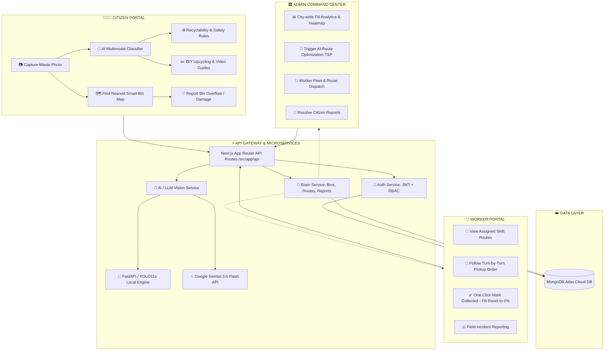
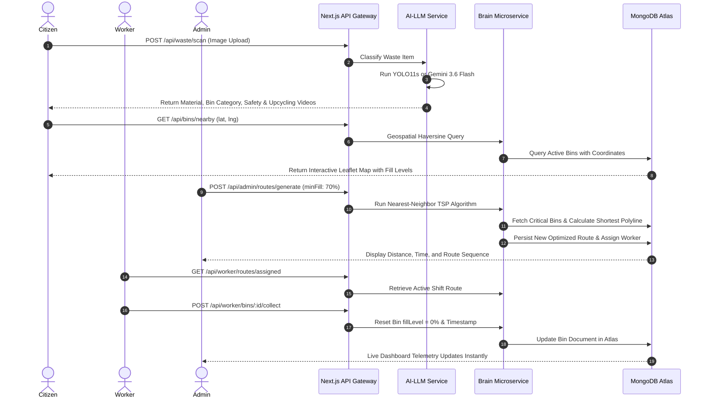
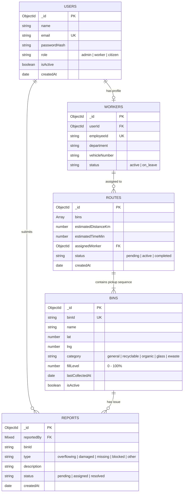

# ♻️ SmartWaste AI — Intelligent Civic Waste Management & Circular Economy Platform

<div align="center">

[](https://sih.gov.in)
[](https://web.dev/progressive-web-apps/)
[](https://nextjs.org/)
[](https://react.dev/)
[](https://ai.google.dev/)
[](https://ultralytics.com)
[](https://www.mongodb.com/atlas)
[](https://tailwindcss.com/)

**Transforming Urban Sanitation, Segregation at Source, and Municipal Operations with Multimodal AI, Geospatial Routing, and Circular Economy Upcycling.**

[Live Demo](#-default-testing--evaluation-accounts) • [System Architecture](#-system-architecture) • [How It Works](#-how-it-works-workflow) • [Social Impact](#-how-it-helps-society-social-impact) • [Tech Stack](#-technology-stack) • [Installation Guide](#-quick-start-guide)

</div>

---

## 📌 Master Documentation Directory

| Document | Focus Area | Contents |
|---|---|---|
| 🔐 **[`README-AUTH.md`](README-AUTH.md)** | **Authentication & Security** | `jose` JWTs, `bcryptjs` password hashing, `HttpOnly` security cookies, server-enforced RBAC, and Edge route protection middleware. |
| 🧠 **[`README-BRAIN.md`](README-BRAIN.md)** | **Brain Core Microservice** | 6 domain sub-services (`admin`, `workers`, `bins`, `reports`, `routes`, `analytics`), Nearest-Neighbor TSP optimization, and MongoDB Atlas schemas. |
| 💻 **[`README-SRC.md`](README-SRC.md)** | **Frontend & UI Systems** | Next.js 16 App Router portals (Citizen, Worker, Admin), Leaflet OpenStreetMap with polyline routing, and SPA navigation. |
| 🤖 **[`ai-llm-service/README.md`](ai-llm-service/README.md)** | **AI / LLM Microservice** | YOLO11s computer vision, Google Gemini 3.6 Flash multimodal vision, safety rule engine, and YouTube tutorial video search. |

---

## 💡 What is SmartWaste AI?

**SmartWaste AI** is an end-to-end, production-grade civic technology ecosystem designed to solve India's mounting municipal solid waste crisis. By seamlessly connecting **Citizens**, **Sanitation Workers**, and **Urban Local Bodies (Municipal Corporations)** onto a single real-time platform, SmartWaste AI transforms passive waste disposal into an active, intelligent, and circular lifecycle.

### The Problem It Solves:
1. **Lack of Waste Segregation at Source**: Citizens struggle to distinguish between recyclable, organic, hazardous, and non-recyclable items, leading to high contamination rates in landfills.
2. **Suboptimal Municipal Waste Collection**: Collection trucks operate on fixed, static routes regardless of whether bins are overflowing or empty, wasting fuel, labor, and municipal budgets.
3. **Absence of Real-Time Civic Feedback**: Citizens lack simple channels to report broken or overflowing bins, while municipalities lack unified real-time visibility into ward-level waste telemetry.
4. **Untapped Upcycling Potential**: Reusable materials (bottles, cartons, e-waste) are discarded rather than diverted into creative circular upcycling.

---

## 🌍 How It Helps Society (Social & Environmental Impact)

SmartWaste AI directly aligns with national priorities including **Swachh Bharat Mission-Urban 2.0**, **Smart Cities Mission**, and the United Nations **Sustainable Development Goals (SDGs)**:

```
  ┌───────────────────────┐    ┌───────────────────────┐    ┌───────────────────────┐
  │   SDG 11: Sustainable │    │   SDG 12: Responsible │    │   SDG 13: Climate     │
  │   Cities & Communities│    │ Consumption/Production│    │   Action              │
  └──────────┬────────────┘    └──────────┬────────────┘    └──────────┬────────────┘
             │                            │                            │
             └────────────────────────────┼────────────────────────────┘
                                          ▼
                      ┌───────────────────────────────────────┐
                      │   🌿 Measurable Social Outcomes       │
                      │ • Up to 40% Fuel & Emission Reduction │
                      │ • 95%+ Accurate Source Segregation    │
                      │ • Dignified, Optimized Worker Shifts  │
                      │ • Accelerated Civic Grievance Action  │
                      └───────────────────────────────────────┘
```

### 1. 🧑‍🤝‍🧑 Citizen Empowerment & Waste Literacy
- **Instant AI Vision Scanner**: Citizens can take a photo of any waste item using their phone camera. The multimodal AI classifies the material in milliseconds, indicates whether it is recyclable, and tells them exactly which color-coded bin to place it in.
- **Circular Economy & Upcycling**: Instead of throwing items away, the platform's Generative AI engine provides step-by-step DIY crafting ideas (e.g., turning plastic bottles into planters or desk organizers) alongside curated YouTube tutorial videos.
- **Interactive Geospatial Bin Finder**: Pinpoints the user’s live GPS coordinates, displays nearby smart bins categorized by waste type, indicates real-time fill levels, and provides turn-by-turn walking routes.

### 2. 👷 Dignity & Efficiency for Sanitation Workers
- **Dynamic Digital Routing**: Municipal drivers and sanitation workers receive real-time, optimized pickup lists prioritizing high-fill bins ($\ge 70\%$).
- **Elimination of Guesswork**: Workers no longer waste time visiting empty or half-empty bins, reducing vehicle idling and physical strain.
- **One-Tap Verification**: Workers verify collections on their mobile dashboard, resetting bin telemetry in real-time across the city grid.

### 3. 🏛️ Data-Driven Governance for Municipal Corporations (ULBs)
- **Live Command & Control Center**: City administrators monitor real-time bin capacities, critical overflow alerts, ward-level heatmaps, and active sanitation personnel.
- **Greedy TSP Route Optimization**: Automatically computes the shortest, most fuel-efficient route across the city, reducing municipal diesel expenditures and carbon emissions.
- **Grievance Redressal**: Geo-tagged citizen incident reports (overflowing, damaged, or blocked bins) are prioritized and assigned with full resolution tracking.

---

## ⚙️ How It Works (Workflow & Architecture)

SmartWaste AI is built upon a **Tri-Portal Architecture** serving three key stakeholders through a unified microservice foundation:



### Detailed Operational Workflows:



---

## 💻 Technology Stack

SmartWaste AI leverages modern, high-performance, and scalable enterprise web technologies:

| Layer | Technology | Purpose & Implementation Details |
|---|---|---|
| **Frontend Framework** | **Next.js 16.3.1 (App Router)** | Server & Client Components, Dynamic Routing, Fast Refresh, Turbo engine. |
| **User Interface** | **React 19.2.8 + Tailwind CSS 4** | Glassmorphism, accessible dark/light palette, responsive mobile-first views. |
| **Icons & Visuals** | **Lucide React & React Icons** | Intuitive visual iconography for waste categories, trucks, status badges. |
| **GIS & Mapping** | **Leaflet 1.9.4 + OpenStreetMap** | Real-time map rendering, custom SVG marker pins, dynamic polyline routing. |
| **Primary AI / Vision** | **Google Gemini 3.6 Flash** | Multimodal zero-shot image classification, material identification, upcycling crafts. |
| **Edge Vision Model** | **Ultralytics YOLO11s-cls** | High-speed local waste classification inference via Python FastAPI service. |
| **Knowledge & Video** | **YouTube Data API v3** | Real-time retrieval of step-by-step DIY upcycling video tutorials. |
| **Backend & APIs** | **Next.js Route Handlers (ESM)** | Modular REST API endpoints across auth, bins, reports, routes, and analytics. |
| **Core Domain Logic** | **`brain-service/`** | 6 isolated domain sub-services handling business logic and route optimization. |
| **Authentication** | **`jose` JWT + `bcryptjs`** | Signed `HttpOnly` cookie session management with Edge Role-Based Access Control. |
| **Database** | **MongoDB Atlas Cloud** | Multi-tenant NoSQL database with 2D geospatial indexing and Mongoose schemas. |
| **Deployment** | **Vercel + Atlas** | Globally distributed Edge deployment with automatic CI/CD pipelines. |

---

## ✨ Key Feature Matrix

| Feature | Citizen Portal | Worker Portal | Admin Portal |
|---|:---:|:---:|:---:|
| **AI Camera Waste Scanner** | ✅ | ❌ | ❌ |
| **Gemini Upcycling & Crafts** | ✅ | ❌ | ❌ |
| **YouTube DIY Video Tutorials** | ✅ | ❌ | ❌ |
| **Interactive GIS Bin Map** | ✅ | ✅ | ✅ |
| **Turn-by-Turn Route Guidance** | ✅ (Walking) | ✅ (Truck Route) | ✅ (Simulation) |
| **One-Click Collect & Telemetry Reset** | ❌ | ✅ | ✅ |
| **Citizen Hazard / Incident Reporting** | ✅ | ✅ | ❌ |
| **Greedy TSP Route Optimizer** | ❌ | ❌ | ✅ |
| **City-Wide Waste Analytics Dashboard** | ❌ | ❌ | ✅ |
| **Sanitation Worker Fleet Management** | ❌ | ❌ | ✅ |
| **Incident Resolution Workflow** | ❌ | ❌ | ✅ |
| **Multi-Role Role-Based Access Control** | ✅ | ✅ | ✅ |

---

## 🗄️ Database Architecture & Schemas

The MongoDB Atlas layer maintains indexed, relationally linked documents:



---

## 🛠️ Environment Configuration

Create a `.env.local` file in the root directory:

```env
# ==============================================================================
# SmartWaste AI - Environment Configuration
# ==============================================================================

# Authentication & Security
JWT_SECRET=smart_waste_ai_jwt_secret_key_development_2026_secure_token

# MongoDB Atlas Database URI
MONGODB_URI=mongodb+srv://<username>:<password>@cluster0.mongodb.net/smart_waste_ai?retryWrites=true&w=majority

# Google Gemini Multimodal AI (Required for AI Scanner & DIY Craft Generation)
GEMINI_API_KEY=your_gemini_api_key_here

# YouTube Data API v3 (Required for Upcycling Video Guides)
YOUTUBE_API_KEY=your_youtube_api_key_here

# Optional: Local FastAPI YOLO11s Computer Vision Service (Default: http://localhost:8000)
ML_SERVICE_URL=http://localhost:8000

# Waste Detection Confidence Threshold (0.0 to 1.0)
WASTE_CONFIDENCE_THRESHOLD=0.70
```

---

## 🚀 Quick Start Guide

### 1. Prerequisites
- **Node.js**: `v18.17.0` or higher
- **npm**: `v9.0.0` or higher
- **MongoDB Atlas** database cluster (or local MongoDB)
- **Google Gemini API Key** ([Get free key at Google AI Studio](https://aistudio.google.com/))

### 2. Clone and Install
```bash
# Clone the repository
git clone https://github.com/<your-username>/smart_waste_ai.git
cd smart_waste_ai

# Install dependencies
npm install
```

### 3. Seed Database with City Telemetry
Initialize MongoDB Atlas with default administrative credentials, worker accounts, and 24 smart bins across city zones:
```bash
node scripts/seed-admin.js
node scripts/seed-bins.js
node scripts/seed-workers.js
```

### 4. Start the Application
```bash
npm run dev
```
Open [http://localhost:3000](http://localhost:3000) in your web browser.

---

## 👥 Default Testing & Evaluation Accounts

Evaluators and SIH judges can immediately explore all three portals using these pre-configured accounts:

| Portal | Role | Email | Password | Access Route |
|:---:|:---:|---|---|---|
| **Citizen Portal** | `citizen` | `ry7437901@gmail.com` | `rajyadav123` | [`/citizen/dashboard`](http://localhost:3000/citizen/dashboard) |
| **Worker Portal** | `worker` | `worker1@smartwaste.local` | `Worker@SmartWaste2026` | [`/worker`](http://localhost:3000/worker) |
| **Worker Portal** | `worker` | `worker2@smartwaste.local` | `Worker@SmartWaste2026` | [`/worker`](http://localhost:3000/worker) |
| **Admin Command Center** | `admin` | `admin@smartwaste.local` | `Admin@SmartWaste2026` | [`/admin`](http://localhost:3000/admin) |

---

## 🐍 Optional: Run Local YOLO11s ML Service (Python)

If you wish to test the on-device Python neural network alongside Google Gemini:

```bash
cd ml-service
python -m venv venv
# On Windows:
.\venv\Scripts\activate
# On Linux/macOS:
source venv/bin/activate

pip install -r requirements.txt
python -c "from ultralytics import YOLO; YOLO('yolo11s-cls.pt')"
# Move yolo11s-cls.pt to ml-service/models/
uvicorn app.main:app --host 0.0.0.0 --port 8000 --reload
```

---

## 🧪 System Verification & Health Check Scripts

The repository includes diagnostic scripts to test database integrity and microservice health:

```bash
# Test all microservices (Auth, Brain, AI, Database):
node scripts/test-all-microservices.js

# Verify all provisioned accounts:
node scripts/list-all-accounts.js

# Deep database audit & schema verification:
node scripts/deep-db-check.js

# Production build test:
npm run build
```

---

## 🔮 Future Roadmap & Scalability

- [ ] **IoT Hardware Integration**: Integration with ESP32 / Arduino LoRaWAN ultrasonic depth sensors for automated, physical bin telemetry.
- [ ] **Green Credits & Gamification**: Reward citizens with redeemable civic points and municipal utility rebates for verified recycling and upcycling.
- [ ] **Multi-Lingual Voice Guidance**: Voice-assisted waste scanning in 12+ Indian regional languages for maximum accessibility.
- [ ] **Truck Fleet Telematics**: Real-time GPS OBD-II tracking of municipal sanitation vehicles with live traffic re-routing.

---

## 📜 License

This project is developed for **Smart India Hackathon (SIH)** and is licensed under the **MIT License** — empowering clean cities and sustainable civic innovation.
